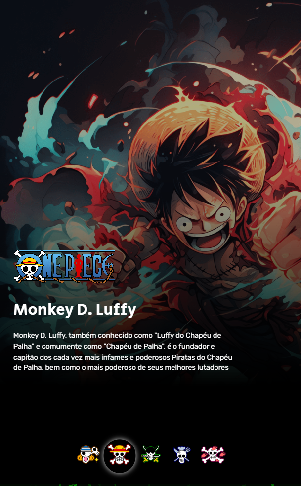

# Treinando com Projetos Anteriores DevQuest

<p style="width: 200px;">Mobile</p>
 
<p>Tablet</p>
 
<p>Desktop</p>
 

## Tecnologias Utilizadas
- HTML
- CSS

## Como Utilizar
Clone do projeto
```
git clone <url>
```
